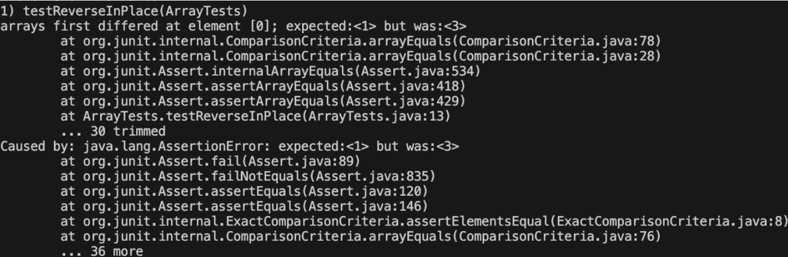

# Part 1 - Bugs 

### 1) jUnit Test that results in failure due to buggy code 
&nbsp;

```
int[] input2 = {1,2,3};
ArrayExamples.reverseInPlace(input2);
assertArrayEquals(new int[]{3, 2, 1} input2);

```


### 2) Input that does not induce failure 
&nbsp;
```
int[] input3 = {1,2,3};
ArrayExamples.reverseInPlace(input3);
assertArrayEquals(new int[]{1,2,3} input3);
```
### 3) The symptom as output of running the test
&nbsp;
;


### 4) Before - and - after changes 
&nbsp;

**Before Fix**

```
 static void reverseInPlace(int[] arr) {
    for(int i = 0; i < arr.length; i += 1) {
      arr[i] = arr[arr.length - i - 1];
    }
  }

```

**After Fix**
```
static void reverseInPlace(int[] arr) {
    for(int i = 0; i < arr.length / 2; i += 1) {
      int temp = arr[i];
      arr[i] = arr[arr.length - i - 1];
      arr[arr.length - i - 1] = temp;
    }


```
### Brief Discription of the fix: 

The original issue in the `reverseInPlace` method resulted from overwriting elements directly without preserving their 
values, leading to data loss and incorrect results, especially after the midpoint of the array. The fix corrects this by:

**Limiting the loop to half the array length** to ensure each element pair is swapped only once, preventing elements from
being swapped back to their original positions.

**Introducing a temporary variable (`temp`)** to hold the value of the current element during the swap, preserving data 
integrity and ensuring a correct swap.

**Implementing correct swapping logic** that ensures each element and its counterpart are swapped correctly, allowing the method to accurately reverse the array for any length, thereby maintaining the integrity of the data throughout the process.
&nbsp;
# Part 2 - Researching Commands

This we will be exploring the `grep` command in detail. `grep` is a command tool that, given a string and a file, identifies and displays all lines within that file that contain the specified string.

### Command-line Option 1: `grep -w`

The `grep -w` option is used to perform searches that match whole words only, ensuring that the search term is found as a distinct, standalone entity, not as a part of a larger word. This specificity is especially useful when you need to filter out matches where the search term appears as a subset of a different term. Here's how it can be applied to the files from your directory listing:

**Examples of using it on files and directories**

**Example 1**

command + output 
```
[user@sahara ~]$ grep -w "American" license.txt
American National Corpus Second Release - Open Portion
WHEREAS, the American National Corpus Consortium (ANCC) has 
American National Corpus, samples of their texts listed 
Second Release of the American National Corpus. The copyright
       American Democracy; 
```
**Description:** 

The `-w` option ensures `grep` matches "American" only as a standalone word, avoiding partial matches within larger words. This precision is crucial in documents like `license.txt`, where specific references to entities like the "American National Corpus" are sought, ensuring search results are relevant and accurate


**Example 2**

Command + Output 
```
[user@sahara ~]$ grep -w "Server" Server.java
public class Server {
        System.out.println("Server started at http://" + InetAddress.getLocalHost().getHostName() + ":"
 + port);

```

**Description:** 

The `grep -w` "Server" command, when applied to `Server.java`, isolates lines where "Server" appears as a distinct word. The output reveals two instances: the declaration of the `Server` class and a print statement indicating the server's start. This demonstrates the command's utility in pinpointing exact mentions of "Server", crucial for identifying class declarations and specific actions related to the server in code.


**Source:** https://pubs.opengroup.org/onlinepubs/009696899/utilities/grep.html#:~:text=DESCRIPTION,option%2C%20or%20the%20pattern_list%20operand.


### Command-line Option 2: `grep -i`


The `grep -i` option is used to perform case-insensitive searches, allowing you to find matches for a search term regardless of its case (uppercase or lowercase). Here's how it can be applied to the files from your directory listing:

**Examples of using it on files and directories:**

**Example 1**

Command + output
```
[user@sahara ~]$ grep -i "charlotte" readme.txt
- Charlotte
```

**Description:** 


The command `grep -i "charlotte" readme.txt` searches for the term "charlotte" within the file `readme.txt`, ignoring case differences. The `-i` option ensures that the search is case-insensitive, matching "Charlotte", "CHARLOTTE", "charlotte", or any other case variation of the term.


**Example 2**

Command + output 

```
[user@sahara ~]$ grep -i "SEARCH" TestDocSearch.java
public class TestDocSearch {
    assertEquals("There are 1391 total files to search.", h.handleRequest(rootPath));
public void testSearch() throws URISyntaxException, IOException {
    URI rootPath = new URI("http://localhost/search?q=Resonance");

```

**Description:** 

The command `grep -i "SEARCH" TestDocSearch.java` searches for the term "SEARCH" in any case within `TestDocSearch.java`, highlighting its use in a class declaration and a test method. This case-insensitive search is crucial for identifying all instances of search-related code, aiding in code review, debugging, and ensuring comprehensive test coverage for search functionalities.

**Source:** 

https://docs.oracle.com/cd/E19620-01/805-3902/6j3n40vti/index.html#:~:text=grep%20is%20very%20often%20used,for%20pipe%20is%20%22%20%7C%20%22.

### Command-line Option 3: `grep -v`

`grep -v` filters out lines containing the specified pattern, showing only those lines in the file that do not match.

**Examples of using it on files and directories:**

**Example 1**

```
[user@sahara ~]$ grep -v "Written" readme.txt
The Open ANC

The the open portion of the American National Corpus 
(OANC) contains approximately 15 millions words from 
the full corpus. The following corpora are included:

Spoken
- Charlotte
- Switchboard

- Eggan (fiction)
- Slate
- Verbatim
- ICIC
- OUP
- 911 Report
- Biomed
- Govenment
- PLOS
- Berlitz

The following annotations are also included:
- Structural markup (divisions, paragraphs) etc. down
  to the paragraph level.
- Sentence boundaries.
- Tokens with Hepple (Penn) part of speech
  annotations.
- Noun chunks
- Verb chunks

INSTALLATION

Run the ANC-install.jar file and follow the on screen
prompts.  On most systems you can simply double 
click on the jar file to run it.  Otherwise, open a command
prompt (Windows), shell (Linux) or Terminal Window 
(Max OS X) and run the following command:

java -jar OANC-installer.jar

After installation use the ANC Tool (downloadable from
the ANC web site)  to merge the standoff  annotations into 
XML or formats that can be used with Monoconc Pro, 
WordSmith, or NLTK (Natural Language Toolkit).

CITATION

Please refer to the Open ANC as follows:

Ide, Nancy, and Suderman, Keith (2007). The Open American National Corpus (OANC). http://www.AmericanNa
tionalCorpus.org/OANC.
```
**Description:** 

The command `grep -v "Written" readme.txt` is intended to exclude lines containing "Written" from the output, aiming to focus on other parts of the document. However, it only removes the specific line with "Written", not the subsequent list of written corpora. This approach is useful for highlighting non-written content, such as spoken corpora and installation instructions, by filtering out specific sections or keywords, albeit with limitations in excluding associated lists without direct keyword matches.

**Example 2**

```
[user@sahara ~]$  grep -v "annotation" annotations.xml
<?xml version="1.0" encoding="UTF-8"?>
<cesHeader xmlns="http://www.xces.org/schema/2003">
    <profileDesc>
    </profileDesc>
</cesHeader>

```

**Description:** 

The command `grep -v "annotation" annotations.xml` removes lines containing "annotation" from `annotations.xml`, resulting in an output that only includes the XML declaration and the structure of the `cesHeader` and `profileDesc` elements. This method is useful for filtering out specific elements or comments from an XML file, simplifying its content.


**Source:** 

https://support.semarchy.com/en/support/solutions/articles/43000653338-how-to-identify-the-java-server-process-id-pid-

### Command-line Option 4: `grep -r`

The `grep -r` command recursively searches for a specified pattern within files in a directory and all of its subdirectories. This option is particularly useful for searching through complex directory structures or projects where the target text might be spread across multiple files.

**Examples of using it on files and directories:**

**Example 1**
```
[user@sahara ~]$ grep -r "Server" ./
grep: ./ServerHttpHandler.class: binary file matches
grep: ./URLHandler.class: binary file matches
grep: ./Server.class: binary file matches
./DocSearchServer.java:class DocSearchServer {
./DocSearchServer.java:        Server.start(port, new Handler(args[1]));
./Server.java:// A simple web server using Java's built-in HttpServer
./Server.java:import com.sun.net.httpserver.HttpServer;
./Server.java:class ServerHttpHandler implements HttpHandler {
./Server.java:    ServerHttpHandler(URLHandler handler) {
./Server.java:public class Server {
./Server.java:        HttpServer server = HttpServer.create(new InetSocketAddress(port), 0);
./Server.java:        server.createContext("/", new ServerHttpHandler(handler));
./Server.java:        System.out.println("Server started at http://" + InetAddress.getLocalHost().getHo
stName() + ":" + port);

```

**Description:** 

The `grep -r "Server" ./` command searches for "Server" across all files in the current directory, showing matches in text files and indicating matches in binary files. It helps identify references to "Server" in the codebase, useful for code review, debugging, and understanding server-related implementations.


**Example 2**
```
[user@sahara ~]$ grep -r "annotations" ./
./readme.txt:The following annotations are also included:
./readme.txt:  annotations.
./readme.txt:the ANC web site)  to merge the standoff  annotations into 
./license.txt:enhanced with various annotations, which constitutes the
./annotations.xml:        <annotations>
./annotations.xml:        </annotations>

```

**Description:** 


The `grep -r "annotations" ./ command` searches all files in the current directory for the term "annotations", listing each occurrence with the file path. This is useful for identifying where annotations are discussed or used, aiding in managing or reviewing annotated content across multiple documents.

**Source:** 

https://docs.oracle.com/cd/E19620-01/805-3902/6j3n40vti/index.html#:~:text=grep%20is%20very%20often%20used,for%20pipe%20is%20%22%20%7C%20%22.


**The Lab Ends Here**


