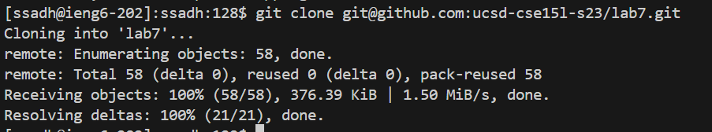

# Lab Report 4 : Vim

In this lab report for Lab 4 - Vim, we will go through a series of steps to improve our efficiency in software development tasks. This includes forking a repository, cloning it, fixing failing tests, and pushing changes. We'll also explore ways to speed up our work using command line shortcuts and Vim. For each step, we'll document the keys pressed and summarize the commands used to understand how these techniques can make us more efficient.

### Step 4

;

### Step 5

;

### Step 6

;

### Step 7

;

### Step 8 

;

### Step 9

;

;
