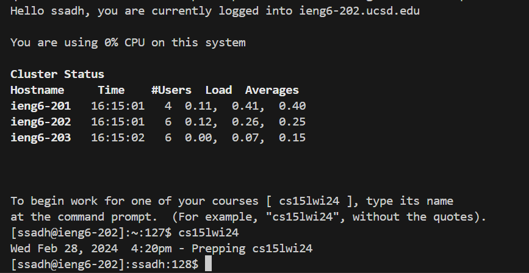
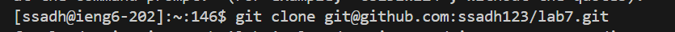
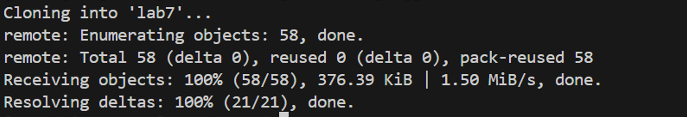
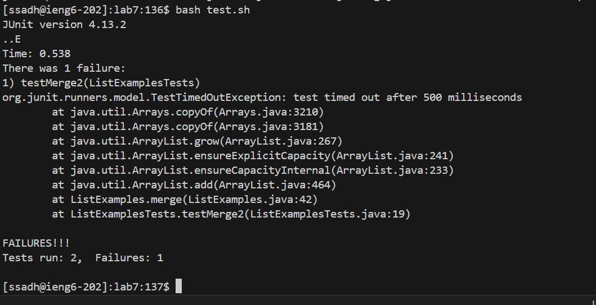
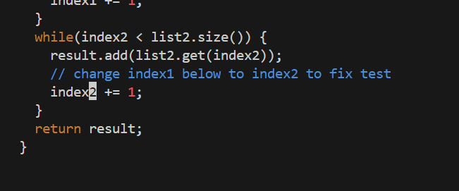
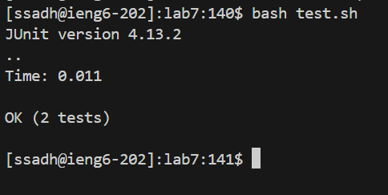
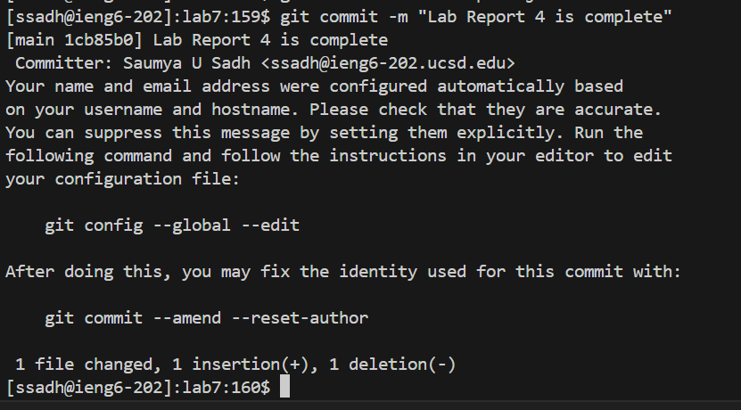
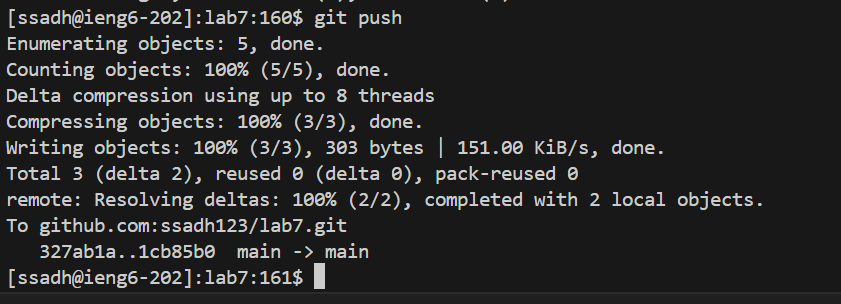

# Lab Report 4 : Vim

In this lab report for Lab 4 - Vim, we will go through a series of steps to improve our efficiency in software development tasks. This includes forking a repository, cloning it, fixing failing tests, and pushing changes. We'll also explore ways to speed up our work using command line shortcuts and Vim. For each step, we'll document the keys pressed and summarize the commands used to understand how these techniques can make us more efficient.

&nbsp;
### Step 4: Log into ieng6 

&nbsp;

&nbsp;

- First we need to open the terminal, for the I used command `Ctrl` + `J` on my Windows laptop
- Then into the ieng6 server using the SSH command `ssh ssadh@ieng6.ucsd.edu <enter>` to log in
- This command establishes a secure shell connection to the UCSD server, allowing you to execute commands remotely on the ieng6 system.

&nbsp;

### Step 5: Clone your fork of the repository from your Github account (using the SSH URL)
&nbsp;

&nbsp;

- Typed the command to clone the repository: `git clone git@github.com:ssadh123/lab7.git <enter>`

&nbsp;
### Step 6: Run the tests, demonstrating that they fail
&nbsp;

&nbsp;

- First `cd <space> lab7/ <enter>` to change directory
- `bash <space> test.sh <enter>` to run the tests. This results in a failure, indicating that the existing code has issues.

&nbsp;
### Step 7: Edit the code file to fix the failing test
&nbsp;

&nbsp;

- Opening Vim: `vim <space> ListExamples.java <enter>` to open the Java file for editing in vim
- Then use the navigation tool `i` which allows you to edit the Java file in vim and insert into the code and fix it
- Then I used `<up>` and `<downn>` arrow keys to find the error line and insert into it
- After making th edit, I pressed `<esc>` to return back to the normal mode
- The to save and exit I pressed `:wq <enter>` to retrurn to the terminal 

&nbsp;
### Step 8: Run the tests, demonstrating that they now succeed
&nbsp;

&nbsp;

- `bash test.sh <enter>` to rerun the tests after the code modification.
- This will show that there are no more failures and the tests succeed 

&nbsp;
### Step 9: Commit and push the resulting change to your Github account
&nbsp;

&nbsp;

