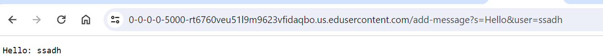
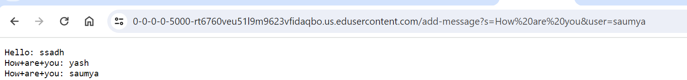
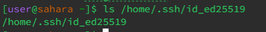
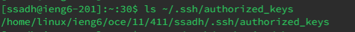
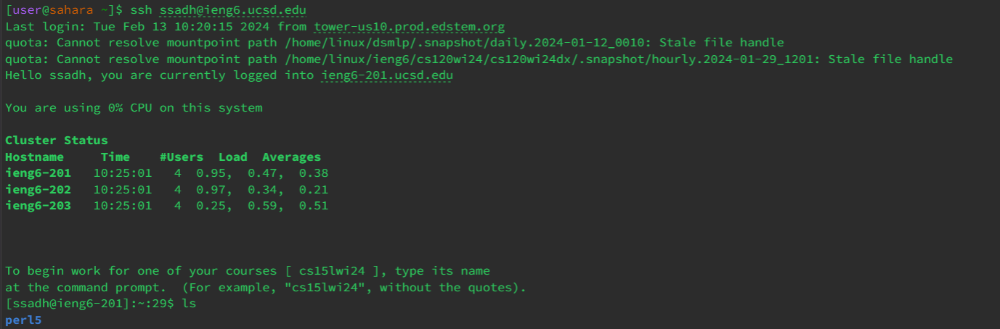

# Part 1 - Create ChatServer


```
import java.io.IOException;
import java.net.URI;
class ChatHandler implements URLHandler {
    
    StringBuilder chatHistory = new StringBuilder();

    public String handleRequest(URI url) {
        if (url.getPath().equals("/")) {
            return String.format("Saumya:\n%s", "Hello");
        } else if (url.getPath().equals("/add-message")) {
            String[] parameters = url.getQuery().split("&");
            String user = parameters[0].split("=")[1];
            String message = parameters[1].split("=")[1];

            chatHistory.append(user).append(": ").append(message).append("\n");

            return chatHistory.toString();
        } else {
            return "404 Not Found!";
        }
    }
}

class ChatServer {
    
    public static void main(String[] args) throws IOException {
        if(args.length == 0){
            System.out.println("Missing port number! Try any number between 1024 to 49151");
            return;
        
        }

        int port = Integer.parseInt(args[0]);
        Server.start(port, new ChatHandler());
    }
}
```


This code represents a basic search engine that operates on an array of strings, simulating a website's content. 
Users can add strings to the search engine's array using the /add method in the query. 
The search engine allows for finding strings containing specific keywords within the array. 
It provides a straightforward mechanism to build and manipulate the content pool for effective searching and retrieval of relevant information.


### **Scenario 1: Adding a message "Hello" from user "ssadh"**

&nbsp;

&nbsp;


**1.Method Called:** The `handleRequest` method in the `ChatHandler` class.

**2.Request URL:** https://0-0-0-0-5000-rt6760veu51l9m9623vfidaqbo.us.edusercontent.com/add-message?s=Hello&user=ssadh

**3.Relevant Arguments:**

`String user`: "ssadh"

`String message`: "Hello"

**4.Relevant Fields:**

`StringBuilder chatHistory`: Initially empty.

**5.Changes in Relevant Fields:**

`chatHistory becomes` "ssadh: Hello\n".


### **Scenario 2: Adding a message "How are you" from user "saumya"** 

&nbsp;

&nbsp;


**1.Method Called:** The handleRequest method in the ChatHandler class.

**2.Request URL:** https://0-0-0-0-5000-rt6760veu51l9m9623vfidaqbo.us.edusercontent.com/add-message?s=How%20are%20you&user=saumya

**3.Relevant Arguments:**

`String user:` "saumya"

`String message:` "How are you"

**4.Relevant Fields:**

`StringBuilder chatHistory:` "ssadh: Hello\n".

**5.Changes in Relevant Fields:**

`chatHistory` becomes "ssadh: Hello\nsaumya: How are you\n".


# Part 2 - Using the Command Line
&nbsp;

### 1. The absolute path to the private key for your SSH Key

&nbsp;

&nbsp;

The private key is `id_ed25519` and the absolute path to the key is `/home/.ssh/id_ed25519`


### 2. The absolute path to the public key for your SSH key to log into ieng6

&nbsp;

&nbsp;

The public key is `id_ed25519.pub` and it is stored in file authorized key. 
The absolute path is `/home/linux/ieng6/oce/11/411/ssadh/.ssh/authorized_keys`


### 3. Log into ieng6 account without asking for password

&nbsp;

&nbsp;

The above image proves that my inputs in the terminal worked as I was not asked for the password upon logging in 


# Part 3 - Week 2 & 3 Lab 

In the Week 2 and Week 3 labs, I learned to set up and deploy a web server using Visual Studio Code, run it locally and on ieng6. I also explored basic URL concepts and used `curl` to access web pages from the command line. The hands-on exercises, including implementing a simple web server (`NumberServer.java`) and creating a basic "Search Engine" (`SearchEngine.java`), provided a practical understanding of web server fundamentals and URL handling. These are all concepts I did not know before. 


