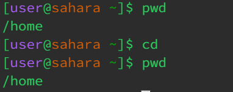
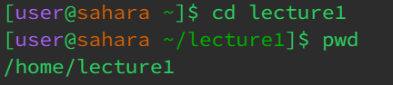
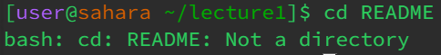
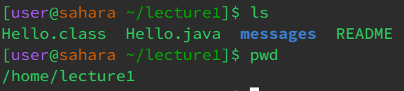
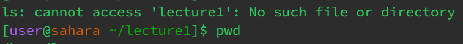
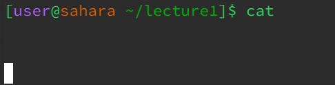
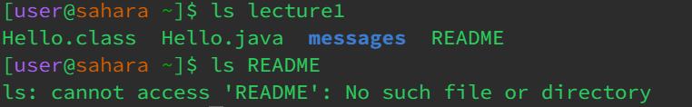
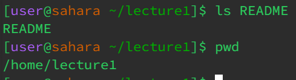

**Using `cd` Command with No Arguments**

When employing the `cd` command without any arguments, the system automatically redirects to the home directory. It provides a quick way to return to the default starting point.

**Checking Present Working Directory (PWD):**

To ensure the successful execution of `cd`, I employed the `pwd` command to confirm the current working directory. The output `/home` signifies that the current location is within the /home directory.

**Using `cd` Command with a Path to a Directory (with argument)**

By utilizing the `cd` command with a specified directory path, I navigated into the "lecture1" directory. The resulting path `/home/lecture1` confirms the successful transition.

**Using `cd` Command with a Path to a File as an Argument**

An attempt to use the cd command with a file as an argument led to an error. This is because "README" is not a directory, and the `cd` command is designed for navigating into directories, not files.

**Utilizing `ls` Command without Arguments**

Executing the `ls` command without any arguments provides a list of files and directories present in the current working directory, which, in this case, is "lecture1."

**Using `ls` Command with Directory Path as an Argument**

When applying the `ls` command with a directory path as an argument, it provides an insight into the contents of the specified directory. However, using this command directly after changing into "lecture1" with `cd lecture1` results in an error.

**Combining ls and cat Commands**

Attempting to use `cat` without any arguments, following a previous `cd lecture1` command, results in an error. This is due to not being in the "lecture1" directory.

**Using `ls` Command with File as Path**

Executing `ls` with a file path as an argument, without changing into the corresponding directory using `cd`, provides a glimpse into the contents of the specified file.

**`ls` README with and without `cd`**

- `ls` command encountered an error because it couldn't find a file or directory named "README" in the current working directory.

- Output README - indicates that a file or directory with the name "README" is present in the current working directory.

** `cat` with no argument**

Executing `cat` with no arguments displays the contents of the standard input. In this case, since no file is specified, it waits for user input. To exit, press `Ctrl + D`.

  

